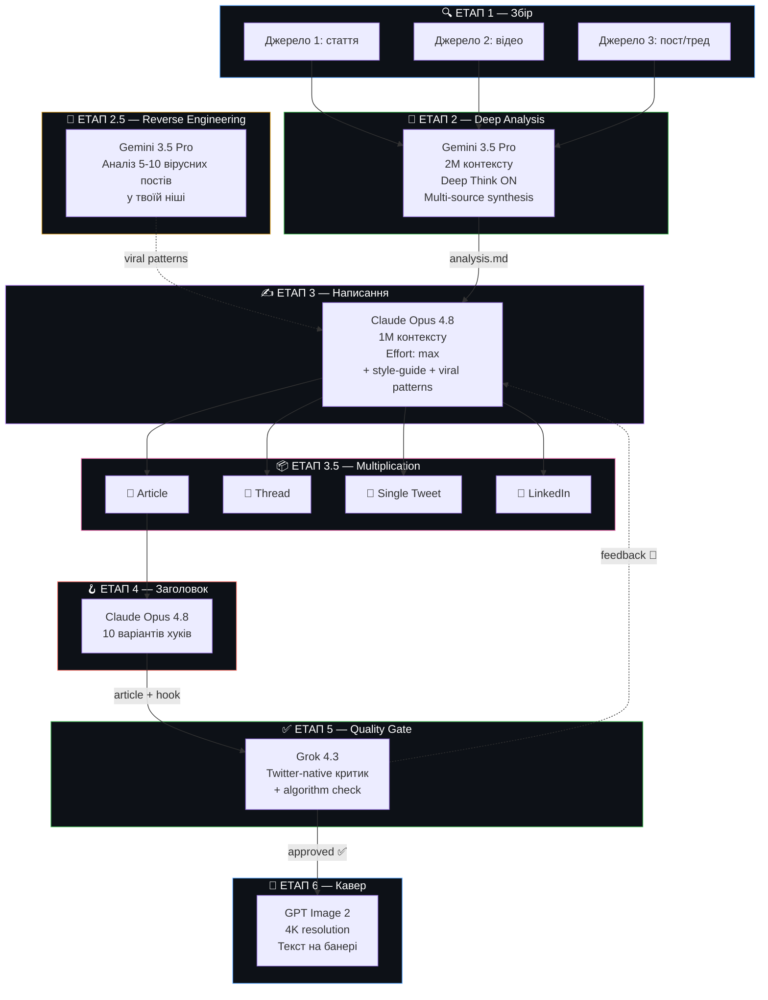
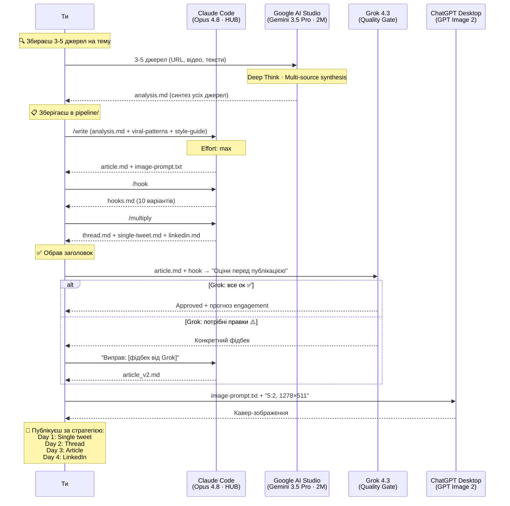

# 🚀 Implementation Plan 2.0 — Twitter Articles Pipeline

> [!IMPORTANT]
> **Чим 2.0 відрізняється від 1.0?**
> 
> Plan 1.0 — це 5 окремих додатків, між якими ти руками копіюєш файли.
> Plan 2.0 — це **7 принципово нових ідей**, які роблять пайплайн розумнішим, швидшим і з кращим результатом.

---

## ⚡ 7 ключових відмінностей від Plan 1.0

````carousel
### 1️⃣ Claude Code як центральний хаб
**Було (1.0):** Перемикаєшся між 4 додатками, copy-paste файлів.
**Стало (2.0):** Claude Code у терміналі — єдина точка входу. Він читає/пише файли, ти переходиш в інші додатки тільки коли потрібно.

```
# Замість відкривання 4 додатків:
cd ~/Twitter-Pipeline
claude
> /analyze    ← готує матеріал для Gemini
> /write      ← генерує статтю
> /hook       ← генерує заголовки
> /review     ← фінальна перевірка
```
<!-- slide -->
### 2️⃣ Multi-Source Analysis (3-5 джерел → 1 стаття)
**Було (1.0):** 1 стаття/відео → 1 аналіз → 1 пост.
**Стало (2.0):** Збираєш 3-5 джерел на одну тему → Gemini аналізує ВСЕ разом → стаття з унікальним кутом, якого немає ніде.

Це робить твій контент **неможливим для копіювання** — бо ніхто інший не зібрав ці ж джерела разом.
<!-- slide -->
### 3️⃣ Quality Gate — Grok як "Twitter-критик"
**Було (1.0):** Написав → опублікував.
**Стало (2.0):** Після написання статті відправляєш її **Grok 4.3** з питанням: "Як Twitter-експерт, оціни цю статтю. Що змінити щоб вона зайшла?"

Grok **нативно розуміє Twitter** — він знає патерни що працюють.
<!-- slide -->
### 4️⃣ Content Multiplication (1 дослідження → 4 формати)
**Було (1.0):** 1 джерело → 1 Article.
**Стало (2.0):** 1 дослідження → одразу 4 формати:
- 📄 Twitter Article (основний)
- 🧵 Thread (5-10 твітів)
- 💬 Single Tweet (280 символів)
- 💼 LinkedIn Post (бонус)

**4x контенту з 1x зусиль.**
<!-- slide -->
### 5️⃣ Algorithm Hacking — оптимізація під X у 2026
**Було (1.0):** Просто пишеш добру статтю.
**Стало (2.0):** Стаття оптимізована під алгоритм X 2026:
- ❌ Зовнішні посилання в тілі поста = reach suppression
- ✅ Посилання тільки в reply
- ✅ Bookmarks (10x) важливіші за лайки (1x)
- ✅ Перші 30-60 хв — критичне вікно
- ✅ Dwell time: форматування що змушує зупинитись
<!-- slide -->
### 6️⃣ Viral Reverse Engineering
**Було (1.0):** Пишеш з нуля, сподіваєшся що зайде.
**Стало (2.0):** Перед написанням аналізуєш 5-10 вірусних постів у твоїй ніші: що спільного? які хуки? яка структура? → застосовуєш ці патерни.
<!-- slide -->
### 7️⃣ Slash Commands у Claude Code
**Було (1.0):** Кожен раз пишеш довгий промпт.
**Стало (2.0):** Створюєш кастомні команди:
- `/analyze` — підготовка матеріалу для аналізу
- `/write` — написання Article
- `/hook` — генерація заголовків
- `/multiply` — 1 стаття → 4 формати
- `/review` — фінальна перевірка через Grok
````

---

## 📊 Архітектура 2.0



---

## 🏗️ Центральний хаб: Claude Code

> [!IMPORTANT]
> **Головна ідея 2.0** — ти не стрибаєш між додатками. Ти відкриваєш **один термінал** з Claude Code, і він стає твоїм "командним центром".
>
> В інші додатки (AI Studio, ChatGPT) ти переходиш тільки для специфічних задач (відео-аналіз, генерація зображення).

### Структура проєкту для Claude Code:

```
~/Twitter-Pipeline/
├── CLAUDE.md                        # Головні інструкції
├── .claude/
│   ├── commands/                    # Slash-команди
│   │   ├── analyze.md               # /analyze
│   │   ├── write.md                 # /write
│   │   ├── hook.md                  # /hook
│   │   ├── multiply.md              # /multiply
│   │   └── review.md                # /review
│   └── skills/
│       ├── twitter-article/
│       │   └── SKILL.md             # Як писати Twitter Article
│       └── viral-patterns/
│           └── SKILL.md             # Патерни вірусного контенту
│
├── knowledge/                       # "Скіли" — постійні знання
│   ├── style-guide.md               # Твій стиль
│   ├── audience-profile.md          # Аудиторія
│   ├── article-examples.md          # Приклади Article
│   ├── viral-hooks-database.md      # База вірусних хуків
│   └── algorithm-rules-2026.md      # Правила алгоритму X
│
├── pipeline/                        # Робочі файли поточного поста
│   ├── raw/                         # Сирі матеріали
│   ├── analysis.md                  # Аналіз від Gemini
│   ├── viral-patterns.md            # Патерни з reverse engineering
│   ├── article.md                   # Стаття
│   ├── thread.md                    # Thread-версія
│   ├── single-tweet.md              # Одиночний твіт
│   ├── linkedin.md                  # LinkedIn-версія
│   ├── hooks.md                     # Варіанти заголовків
│   ├── review.md                    # Фідбек від Grok
│   └── image-prompt.txt             # Промпт для кавер
│
├── archive/                         # Архів опублікованих
│   └── 2026-06-19_topic/
└── images/                          # Готові кавер-зображення
```

### CLAUDE.md (головний файл):

```markdown
# Twitter Article Pipeline

## Проєкт
Це пайплайн для створення вірусних Twitter Articles.
Стиль: як @DimaHolovatyi — конкретні цифри, step-by-step, clickbait заголовки.

## Воркфлоу
1. Я кладу сирі матеріали в `pipeline/raw/`
2. Команди `/analyze`, `/write`, `/hook`, `/multiply`, `/review`
3. Всі проміжні файли зберігаються в `pipeline/`
4. Після публікації — `/archive` переносить все в `archive/`

## Правила
- Завжди читай `knowledge/style-guide.md` перед написанням
- Завжди читай `knowledge/algorithm-rules-2026.md` для оптимізації
- Effort: max для всіх задач
- Мова постів: [вкажи мову]
- Ніколи не вигадуй факти — тільки те що є в analysis.md
```

---

## 📋 Етап за етапом (детально)

### ЕТАП 1 — Збір матеріалів (руками)

**Що нового в 2.0:** Збираєш **3-5 джерел** на одну тему, а не одне.

| Тип джерела | Де шукати | Що зберігати |
|---|---|---|
| Статті | Medium, Substack, блоги | URL або copy-paste тексту |
| Відео | YouTube, TikTok | URL (Gemini сам проаналізує) |
| Пости/треди | Twitter/X, Reddit | Скріншот або текст |
| Подкасти | Spotify, Apple | Аудіо або транскрипт |

Зберігай все в `~/Twitter-Pipeline/pipeline/raw/`

---

### ЕТАП 2 — Deep Analysis (Gemini 3.5 Pro)

**Де:** Google AI Studio · **Gemini 3.5 Pro** · 2M токенів · Deep Think ON

**Що нового в 2.0:** Multi-source synthesis — надсилаєш ВСЕ джерела в один чат.

#### System Instructions:

```
Ти — аналітик контенту для Twitter Articles.
Тобі надсилають КІЛЬКА джерел на одну тему (статті, відео, пости).

Твоя задача — створити СИНТЕЗ, а не просто переказ:
1. Знайди спільні тези між джерелами
2. Знайди СУПЕРЕЧНОСТІ між джерелами
3. Знайди унікальні інсайти яких немає ніде окремо
4. Визнач найсильніший кут подачі для Twitter Article

Формат:

# Multi-Source Analysis: [Тема]

## 🔗 Джерела
1. [назва + тип + автор]
2. ...

## 📋 Синтез (загальна картина)
[Що ми знаємо з УСІХ джерел разом? Яка більша картина?]

## 🎯 Ключові тези (з посиланнями на джерела)
- [теза] ← Джерело 1, 3
- [теза] ← Джерело 2
...

## ⚔️ Суперечності
- [джерело X каже А, джерело Y каже Б — хто правий?]

## 💡 Унікальний кут (якого немає в окремих джерелах)
[Інсайт який виникає ТІЛЬКИ коли зіставляєш усі джерела]

## 🔥 Потенціал для Twitter Article
- Головна ідея
- Кут подачі (цифри + метод)
- Емоційний тригер
- 3 варіанти формули заголовка

## 📝 Факти та цитати для статті
[Конкретні цифри, кроки, методи — все що можна використати]
```

---

### ЕТАП 2.5 — Viral Reverse Engineering (Gemini 3.5 Pro) ← НОВЕ!

**Де:** Google AI Studio (той самий або новий чат)

**Суть:** Перед написанням статті аналізуєш 5-10 вірусних постів у твоїй ніші.

#### Як це працює:

1. Збери 5-10 скріншотів/текстів вірусних постів (10K+ лайків) у твоїй тематиці
2. Надішли їх Gemini з таким промптом:

```
Проаналізуй ці 10 вірусних Twitter-постів/Articles.

Для кожного визнач:
1. Формула хука (перший рядок)
2. Структура (як побудований текст)
3. Емоційний тригер (curiosity? fear? greed? FOMO?)
4. Формат (thread? article? single?)
5. Чому це зайшло (що зробило його вірусним)

Потім створи:

# Viral Patterns Report

## 📊 Спільні патерни
- [що спільного у всіх вірусних постів]

## 🪝 Формули хуків які працюють
1. [формула 1] — приклад: "..."
2. [формула 2] — приклад: "..."
...

## 📐 Структури які працюють
1. [структура 1]
2. [структура 2]

## 🎭 Емоційні тригери (рейтинг)
1. [тригер 1] — використано в N з 10 постів
...

## 📏 Рекомендації для моєї наступної статті
[Конкретні поради на основі аналізу]
```

3. Зберігай як `pipeline/viral-patterns.md`
4. Claude буде використовувати ці патерни при написанні статті

> [!TIP]
> Цей етап достатньо робити **раз на тиждень** — патерни не змінюються щодня.

---

### ЕТАП 3 — Написання Article (Claude Opus 4.8)

**Де:** Claude Code (термінал) або Claude Desktop

**Що нового в 2.0:**
- Claude отримує не лише `analysis.md`, а й `viral-patterns.md`
- Claude знає правила алгоритму X 2026
- Одразу генерує промпт для зображення
- Effort: max

#### Slash Command `/write` (для Claude Code):

```markdown
# /write — Write Twitter Article

Read the following files:
1. `pipeline/analysis.md` — source analysis
2. `pipeline/viral-patterns.md` — viral patterns (if exists)
3. `knowledge/style-guide.md` — my writing style
4. `knowledge/algorithm-rules-2026.md` — X algorithm rules

Then write a Twitter Article following these rules:
- Apply viral patterns from the analysis
- Use my exact tone of voice from the style guide
- Optimize for X algorithm (dwell time, bookmarks, engagement velocity)
- Include concrete numbers and step-by-step instructions
- Length: 800-2000 words

Save output to `pipeline/article.md`
Also save image prompt to `pipeline/image-prompt.txt`
```

---

### ЕТАП 3.5 — Content Multiplication ← НОВЕ!

**Де:** Claude Code (той самий чат)

**Суть:** Одна стаття → 4 формати контенту.

#### Slash Command `/multiply`:

```markdown
# /multiply — Create 4 content formats

Read `pipeline/article.md` and create:

1. `pipeline/thread.md` — Twitter Thread (5-10 твітів)
   - Перший твіт = найсильніший хук
   - Кожен твіт = окрема цінність
   - Останній = CTA + "Follow for more"

2. `pipeline/single-tweet.md` — Одиночний твіт (280 символів)
   - Найголовніший інсайт з статті
   - Максимально інтригуюча подача

3. `pipeline/linkedin.md` — LinkedIn пост
   - Більш професійний тон
   - Перші 3 рядки = hook (до "see more")
   - 1200-1500 символів

4. Update `pipeline/article.md` — додай в кінці:
   ## Стратегія публікації
   - Day 1: Single tweet (тестування реакції)
   - Day 2: Thread (якщо single зайшов)
   - Day 3: Article (головний контент)
   - Day 4: LinkedIn (інша аудиторія)
```

> [!TIP]
> **4x контенту з 1x дослідження.** Ти витратив час на аналіз один раз, але отримуєш контент на 4 дні.

---

### ЕТАП 4 — Генерація заголовка

**Де:** Claude Code (той самий чат) + опціонально Grok 4.3

Те саме що в Plan 1.0, але з доповненням — Claude тепер має `viral-patterns.md` і генерує заголовки на основі формул які вже працюють.

---

### ЕТАП 5 — Quality Gate (Grok 4.3) ← НОВЕ!

**Де:** grok.com або SuperGrok

**Суть:** Перед публікацією надсилаєш готову статтю + заголовок Grok для фінальної перевірки.

#### Промпт:

```
Ти — експерт Twitter/X з 5+ років досвіду. 
Тебе створила компанія яка ВОЛОДІЄ Twitter.
Ти знаєш алгоритм зсередини.

Оціни цю Twitter Article перед публікацією:

[вставляєш article.md + обраний заголовок]

Дай відповідь у форматі:

## ✅ Що добре
- [...]

## ⚠️ Що покращити
- [конкретна порада 1]
- [конкретна порада 2]

## 🪝 Оцінка заголовка: [X/10]
- Покращений варіант: [якщо є]

## 📊 Прогноз engagement
- Ймовірність вірусності: [low/medium/high]
- Чому: [...]
- Що змінити для high: [...]

## 🚫 Algorithm Red Flags
- [є щось що алгоритм може придушити?]
- Зовнішні посилання в тілі? → перенеси в reply
- Негативний sentiment? → переформулюй
```

**Якщо Grok каже "покращити" → повертайся до Claude з конкретним фідбеком.**

---

### ЕТАП 6 — Кавер-зображення (GPT Image 2)

Те саме що в Plan 1.0 — **ChatGPT Desktop** → **GPT Image 2** → банер 5:2.

---

## 🔄 Повний алгоритм 2.0



---

## 📊 Algorithm Rules 2026 (вбудувати в knowledge/)

Це файл `knowledge/algorithm-rules-2026.md` — Claude буде читати його перед кожним написанням:

```markdown
# X/Twitter Algorithm Rules 2026

## Engagement Hierarchy (множники)
- 150x: Reply що спровокував діалог з автором
- 27x: Звичайний reply
- 20x: Quote repost
- 10x: Bookmark ← ВАЖЛИВО! Пиши контент який хочеться зберегти
- 1x: Like (базовий)

## Critical Window
- Перші 30-60 хвилин після публікації вирішують все
- Engagement velocity = головний сигнал для алгоритму
- Публікуй коли аудиторія онлайн (8-11 AM weekdays)

## Reach Suppressors ❌
- Зовнішні посилання в тілі поста → ЗАВЖДИ в reply
- Негативний/агресивний sentiment → Grok throttles
- Спам-постинг (>10 постів/день)

## Reach Boosters ✅
- X Premium — обовʼязково для органічного reach
- Dwell time — форматуй так щоб читач ЗУПИНИВСЯ
- Line breaks для візуального пейсингу
- Конструктивний позитивний sentiment

## Format Performance
- Text-only часто > image/video для engagement
- Threads > single tweets для reach
- Articles = maximum dwell time

## 70/30 Rule
- 70% часу: стратегічні replies на акаунти з великою аудиторією
- 30% часу: оригінальний контент
```

---

## 🛠️ Зведена таблиця 2.0

| Етап | Де | Модель | Контекст | Що робить | Нове в 2.0? |
|---|---|---|---|---|---|
| 1 | Руками | - | - | Збір 3-5 джерел | Multi-source |
| 2 | **AI Studio** | **Gemini 3.5 Pro** | **2M** | Deep analysis + synthesis | Multi-source synthesis |
| 2.5 | **AI Studio** | **Gemini 3.5 Pro** | **2M** | Reverse engineering вірусних постів | ✅ НОВЕ |
| 3 | **Claude Code** | **Opus 4.8** | **1M** | Написання Article | + viral patterns + algorithm rules |
| 3.5 | **Claude Code** | **Opus 4.8** | **1M** | 1 стаття → 4 формати | ✅ НОВЕ |
| 4 | **Claude Code** | **Opus 4.8** | **1M** | 10 заголовків | На основі viral формул |
| 5 | **Grok** | **Grok 4.3** | **1M** | Quality Gate + прогноз | ✅ НОВЕ |
| 6 | **ChatGPT** | **GPT Image 2** | - | Кавер-зображення | Без змін |

---

## ⚠️ User Review Required

> [!IMPORTANT]
> **Обери що тобі більше підходить:**
> 
> | | Plan 1.0 | Plan 2.0 |
> |---|---|---|
> | **Складність** | Простий | Складніший |
> | **Час на 1 пост** | ~30 хв | ~45-60 хв |
> | **Кількість контенту** | 1 Article | 4 формати |
> | **Якість** | Добра | Максимальна |
> | **Вірусний потенціал** | Середній | Високий |
> | **Інструменти** | 4 додатки, copy-paste | Claude Code як хаб |
> | **Навчання алгоритму** | ❌ | ✅ Algorithm-aware |
> | **Quality Gate** | ❌ | ✅ Grok-review |
> 
> **Можна комбінувати:** взяти за основу 1.0 і додати окремі елементи з 2.0 (наприклад, тільки Quality Gate або тільки Content Multiplication).

## Open Questions

> [!NOTE]
> **Ті самі 4 питання що й раніше:**
> 1. **Стиль:** Надішли приклади постів → `style-guide.md`
> 2. **Мова:** Англійська / українська?
> 3. **Тематика:** AI / Money / Tech?
> 4. **Підписки:** Claude Pro + ChatGPT Plus?
>
> **+ нове питання для 2.0:**
> 5. **Claude Code:** Чи встановлений у тебе Claude Code? (Перевір: `claude --version` в терміналі)
